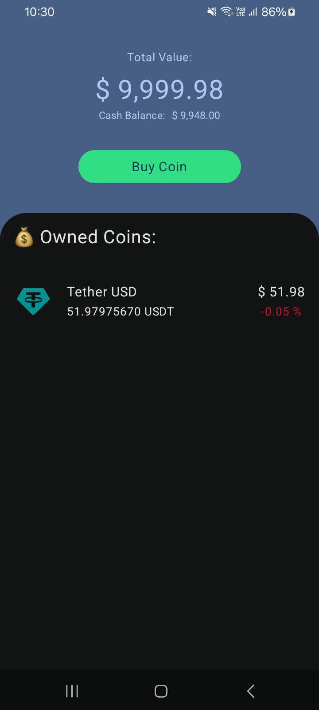
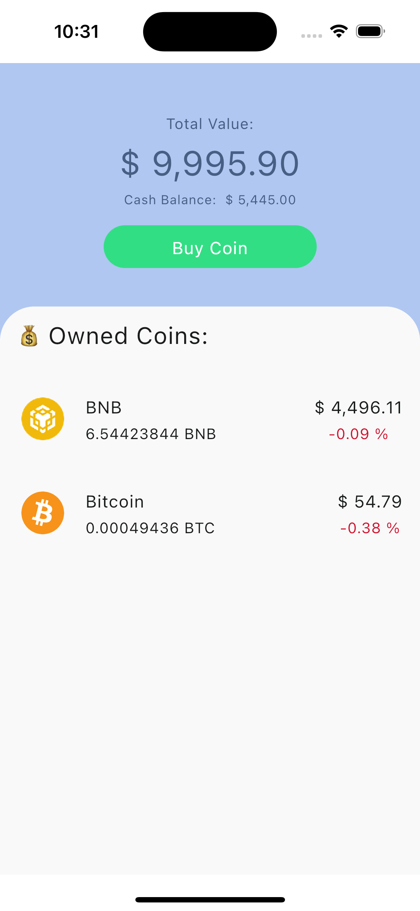

# CoinRoutine

**CoinRoutine** is a cross-platform mobile application built using Kotlin Multiplatform Mobile (KMM).
It provides a seamless experience for managing cryptocurrency coins with features like viewing a list of coins from an API and performing local buy/sell operations using a local database.

## 🔧 Features

- 📡 Fetches coin list from remote API
- 💾 Handles buy/sell operations using local database:
  - **Room** (Android)
  - **SQLDelight** (shared)
- ⚙️ Modern MVVM architecture with shared business logic
- 🎨 Compose Multiplatform UI (Android + iOS)
- 🧪 Unit tests for business logic

## 🛠️ Technologies Used

- **Kotlin Multiplatform Mobile (KMM)**
- **Jetpack Compose + Compose Multiplatform**
- **Ktor** for networking
- **Room (Android)**
- **SQLDelight (shared DB logic)**
- **MVVM Architecture**
- **Dependency Injection (Koin or Hilt)**
- **Unit testing** with common test framework

## 📸 Screenshots

### Android



### iOS



## 🚀 Getting Started

### Prerequisites

- Android Studio Hedgehog or higher with Kotlin Multiplatform plugin
- Xcode (for iOS development)
- JDK 17+

### Steps

1. **Clone the repository**
    ```bash
    
    ```

2. **Open the project in Android Studio**

3. **Run the Android app**
  - Select the `androidApp` module and run on emulator or device.

4. **Run the iOS app**
  - Use Compose Multiplatform setup
  - Open `iosApp/iosApp.xcodeproj` (if exists) or run via KMM bridge


Developed with ❤️ using Kotlin Multiplatform and Compose Multiplatform.
